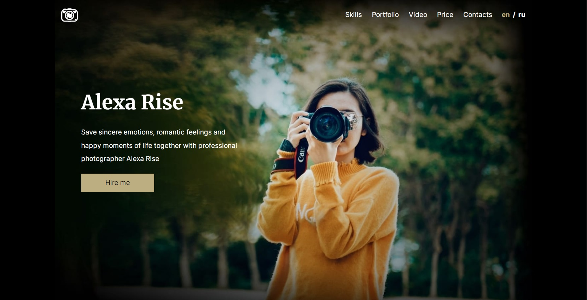

# portfolio

## Описание проекта
Portfolio – это сверстанный landing page портфолио фотографа, с адаптивностью и интерактивностью.

## Ключевые навыки:
- валидная семантическая адаптивная вёрстка
- легкоподдерживаемый читаемый код
- экспорт стилей и графики из Figma
- использование JavaScript для реализации указанного в задании функционала

## Этапы работы над проектом:
Задание состоит из трёх частей:
- Часть 1. Фиксированная вёрстка 
  - в этой части задания страница свёрстана по макету и корректно отображается при ширине экрана не меньше 1440рх
- Часть 2. Адаптивная вёрстка
  - в этой части задания была добавлена адаптивность свёрстанной странице. При ширине страницы 768рх вёрстка совпадает с макетом, на остальных разрешениях до 320рх включительно обеспечено отсутствие горизонтальной полосы прокрутки.  
  Также на этом этапе в вёрстку добавлено адаптивное меню, для создания которого используется js.
  - вёрстка совпадает с макетом при ширине страницы 768рх, отсутствует горизонтальная полоса прокрутки, работает адаптивное меню
- Часть 3. Добавление функционала
  - в этой части задания используется JavaScript для добавления странице интерактивности: 
     - смена изображений в секции `portfolio`
     - перевод страницы на два языка
     - возможность переключения светлой и тёмной темы

<kbd></kbd>

[Макет в figma](https://www.figma.com/file/1A1SJ7FYyMUiBqhU3WUiBI/Portfolio)  

- Вёрстка состоит из трёх блоков: `<header>`, `<main>`, `<footer>`
- Блок `<main>` состоит из шести секций `<section>`:
  - `hero`
  - `skills`
  - `portfolio`
  - `video`
  - `price`
  - `contacts`
  
[Деплой проекта](https://zixail28.github.io/portfolio/)  
